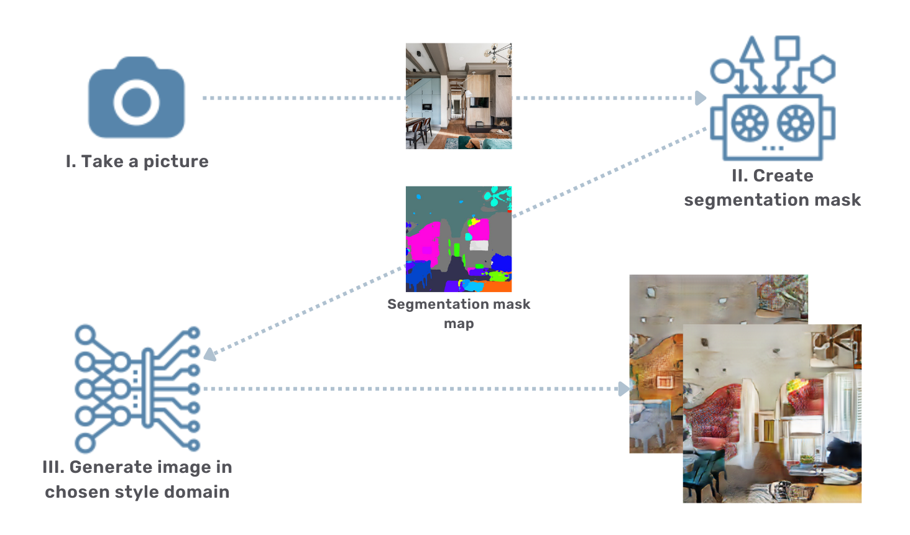
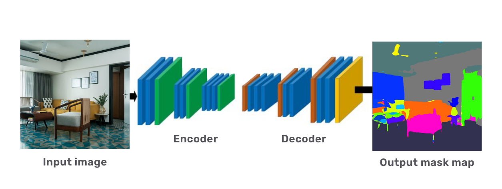
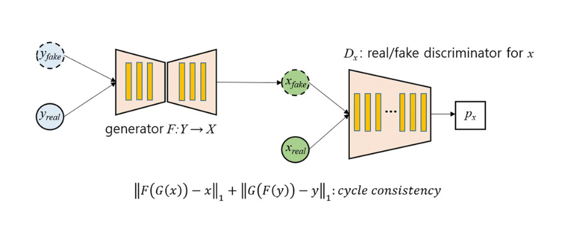
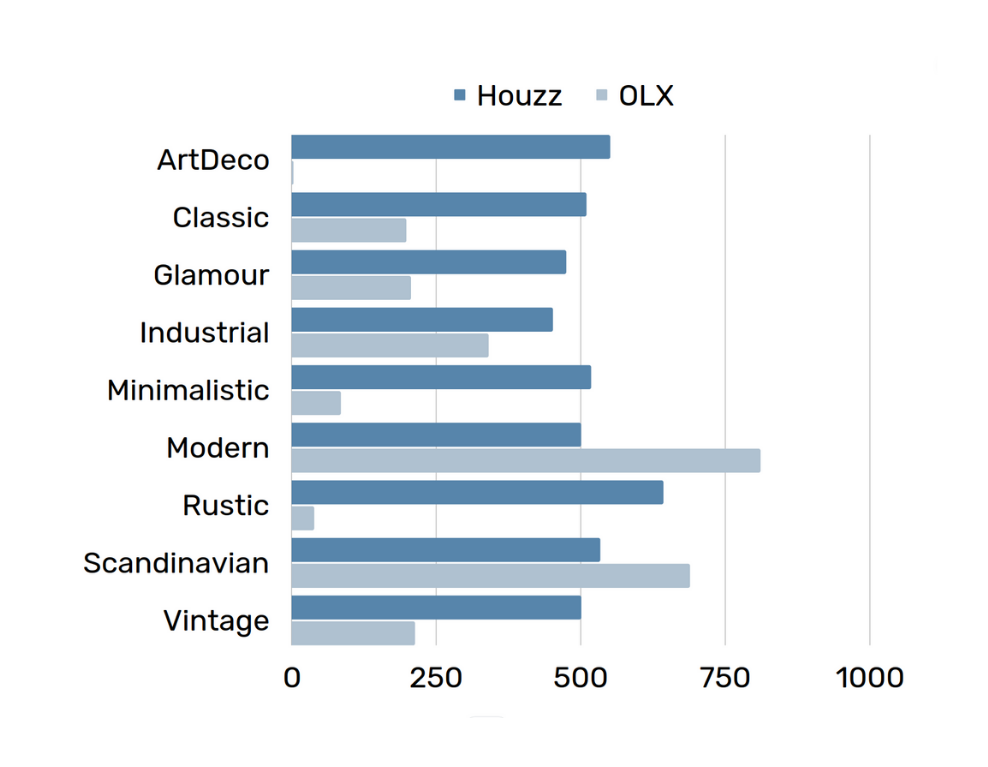
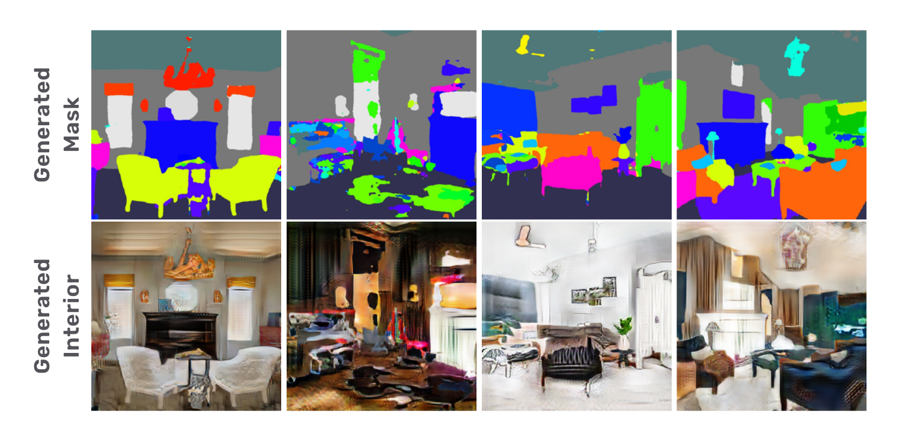
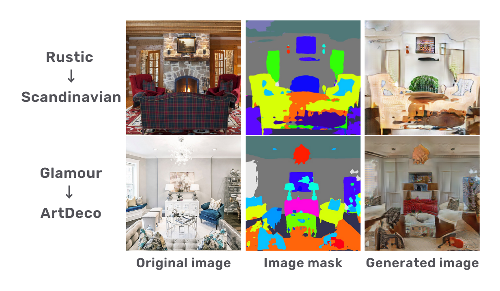

# InDeSTra system for interior design style transfer
## System for interior design style transfer - repository for implementation of Masters Thesis project. 

An average person will spend approximately 90% of the lifetime indoor and we know that the environment can affect the condition of the individual. ​
For this reason, it is a good approach to adapt the surroundings to fit our needs and enhance the mental state. ​
​Interior design, which is required to fulfill the mentioned goal, is not an easy to tackle task, that requires a lot of time, experience in designing and, in most cases, money. It makes even less sense in case a simple but realistic concept is needed. ​
​The search for a way to enhance and facilitate this task motivated this research.​

# Models

## Encoder Decoder Semantic Segmentation
The model's architecture consists of two submodels: Semantic Segmentation and CycleGAN model. The first was pretrained on the MID ADE20K dataset, a well-known industry benchmark. 

## CycleGAN
CycleGAN - the second model, has learnt characteristics of different decorations from images collected in a dataset as a part of the project.

# Data
The data has been collected across two major interior design platforms. The resulting dataset consists of over 12.000 images representing nine styles of decoration, from which ~4700, considered as the most valuable – emphasizing characteristics of the design styles – have been used to train the models. 
The rest of the images, has been ordered to be annotated, to be used in further experiments. 
The division of classes across collections of annotated images is observable in the graph below.

# Results
## From mask generation

## Style transfer

## Final thoughts
 - Retrieving characteristics of different interior design styles is a nontrivial task​
 - Generator results strongly depend on the segmentation product
 - Lack of information about the exact shape of individual things detected on the input image results in a blurred appearance of generated object 
 - Two objects of the same class located close to each other are considered by the model as one object.

Created by Mateusz Ogrodowczyk, Joanna Kurczalska, Jakub Eichner
